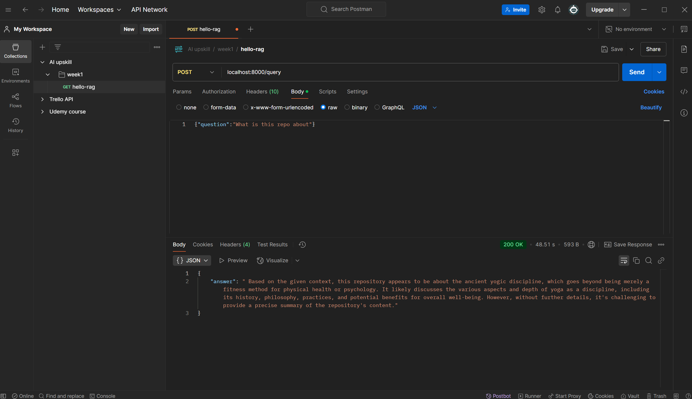

# hello-rag

Minimal Retrieval-Augmented Generation stack that fits on a CPU-only
laptop (32 GB RAM).

## Stack

| Component | Version | Purpose |
|-----------|---------|---------|
| Qdrant | `latest` | Vector DB |
| llama.cpp | `server` tag | GGUF inference |
| FastAPI | 0.111 | RAG glue |

## Quick start

```bash
# 0. inside ai-upskill/stage01_rag/week1/hello_rag
huggingface-cli download microsoft/Phi-3-mini-4k-instruct-gguf Phi-3-mini-4k-instruct-q4.gguf --local-dir models

docker compose pull          # fetch qdrant + llama images
docker compose up -d --build # build FastAPI and start all services
python ingest.py             # load sample docs (place *.txt in ./data)

curl -X POST localhost:8000/query \
     -H "content-type: application/json" \
     -d '{"question":"What is this repo about?"}'
```

## When things go well

```bash
ai-upskill\stage01_rag\week1\hello_rag> python ingest.py  
Ingested 1 documents into collection 'docs'.
ai-upskill\stage01_rag\week1\hello_rag>
```

```bash
ai-upskill\stage01_rag\week1\hello_rag> docker ps
CONTAINER ID   IMAGE                               COMMAND                  CREATED         STATUS                     PORTS                              NAMES
c37690cd3184   hello_rag-api                       "uvicorn main:app --…"   8 minutes ago   Up 8 minutes               0.0.0.0:8000->8000/tcp             hello_rag-api-1
87301378e6c4   qdrant/qdrant                       "./entrypoint.sh"        8 minutes ago   Up 8 minutes               0.0.0.0:6333->6333/tcp, 6334/tcp   hello_rag-qdrant-1
8e2a6f24fc73   ghcr.io/ggml-org/llama.cpp:server   "/app/llama-server -…"   8 minutes ago   Up 8 minutes               0.0.0.0:8001->8000/tcp             llama-cpu
ai-upskill\stage01_rag\week1\hello_rag
```

